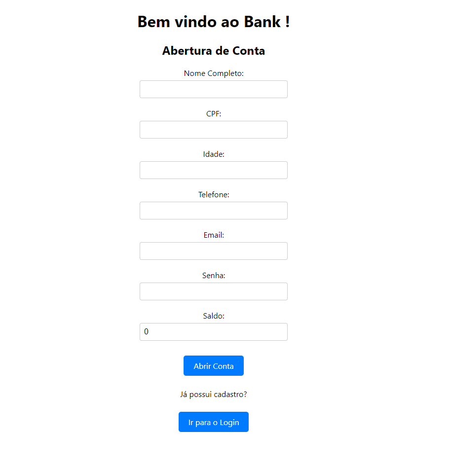
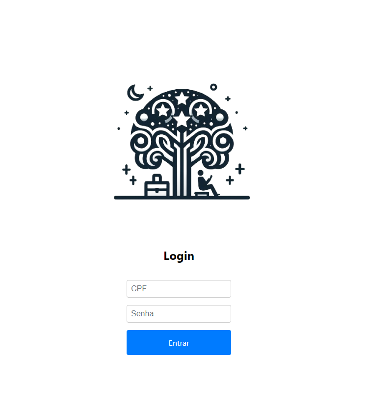
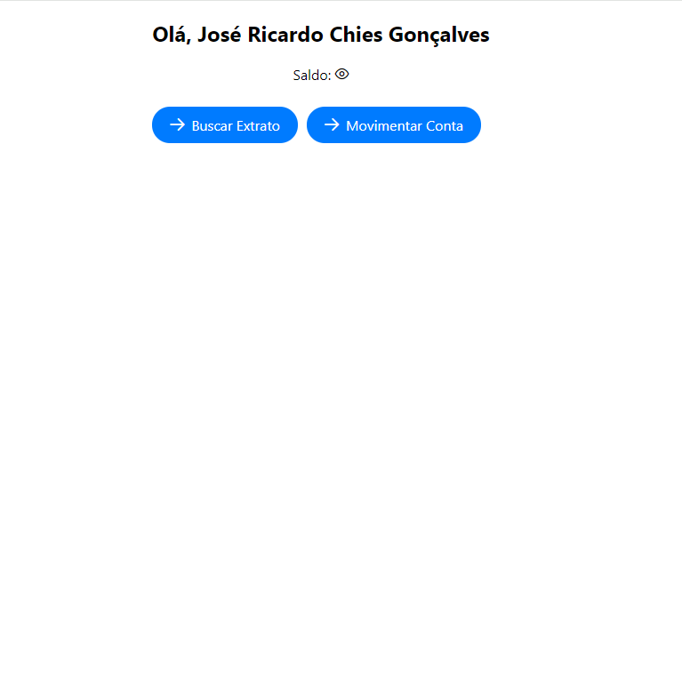
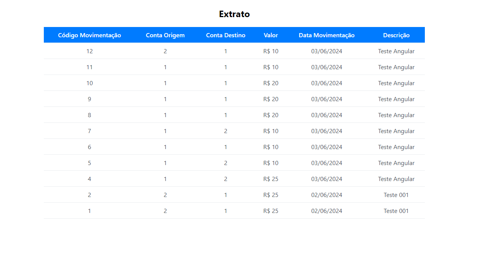
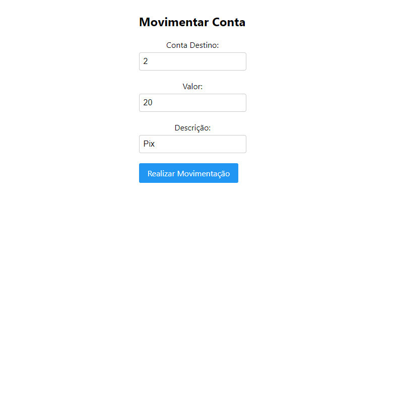

# BANK APP ANGULAR

# Descrição
Este projeto consiste na criação de uma aplicação web utilizando angular com template free do PrimeNG. 

# Funcionalidades

Tela de Início
<ul>
  <li>Cliente pode realizar o cadastro de uma conta, ou ir para tela de login caso possua uma conta aberta.</li>
</ul>

Login
<ul>
  <li>Realiza o login do cliente pelo CPF e senha.</li>
</ul>

Dashboard do Cliente: 
<ul>
  <li>Visualização de saldo atual.</li>
  <li>Visualização de extrato da conta.</li>
  <li>Realização de movimentações financeiras.</li>
</ul>

# Layout do Projeto

  
  
  
  
  

# Autor
José Ricardo Chies Gonçalves

LinkedIn:
https://www.linkedin.com/in/ricardo-chies-087557216/

E-mail:
chies.dev@gmail.com
